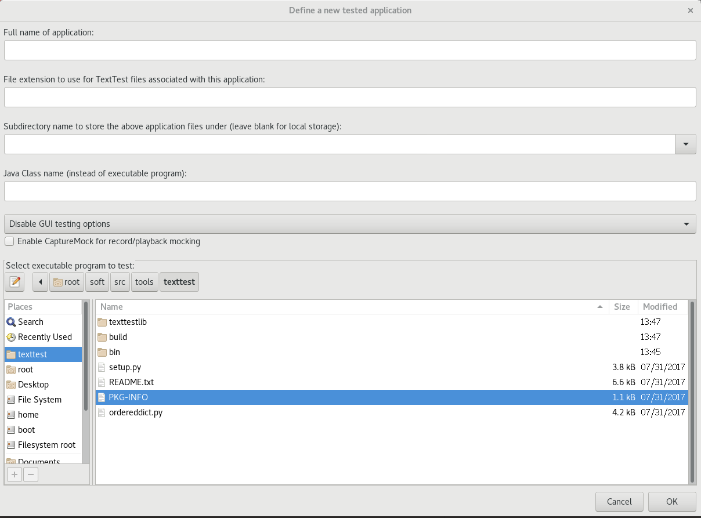

You can install following official guide: [Installation Guide](https://texttest.readthedocs.io/en/latest/installation.html) or following unofficial guide.

## Linux installation guide

### Step 01: check your enviroment

```
$ python
Python 2.7.5 (default, Oct 30 2018, 23:45:53) 
[GCC 4.8.5 20150623 (Red Hat 4.8.5-36)] on linux2
Type "help", "copyright", "credits" or "license" for more information.
>>> import gtk
>>>
```

make sure you already have PyGTK installed.

### Step 02:  install texttest

```
$ git clone git@github.com:scutse/texttest.git
$ cd texttest
$ python setup.py install
```

### Step03: use texttest

```
$ texttest
```

and you can get the following window:



That you done!
